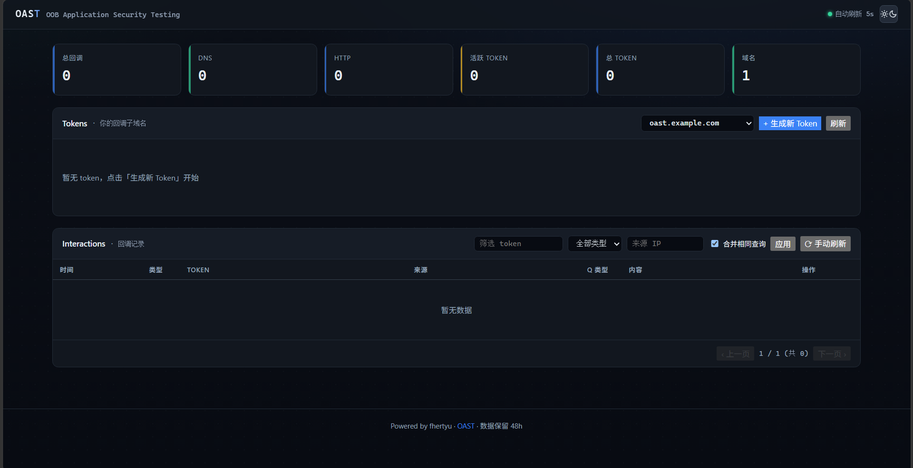

## 效果展示



## 特性

- **DNS OOB 采集**：UDP + TCP，支持 A/AAAA/CNAME/TXT/MX/NS（基于 `miekg/dns`）
- **HTTP 回调采集**：完整请求记录（method/url/headers/body/cookie/UA/referer/src_ip）
- **双后端存储**：默认内存模式（256MB 上限治理）；可选 SQLite 落盘（WAL，重启不丢数据）
- **多域名支持**：后缀 trie 自动识别，多 Zone 独立配置
- **Token 系统**：`crypto/rand` 生成，8 字符 base32url，生命周期管理
- **Web 管理后台**：Dashboard、Interaction 详情、搜索/筛选/分页
- **浏览器隔离**：每个浏览器（匿名访客 cookie）只能看到自己创建的 Token 与回调
- **dnslog 风格密码门**：可选密码保护（仅密码，无用户名），或完全开放；登录失败限速
- **单二进制部署**：纯 Go，无 CGO，跨平台交叉编译

## 声明
本工具仅供合法授权的安全测试使用，因使用本工具产生的一切法律责任由使用者自行承担。

## 性能目标

| 指标 | 目标 |
|------|------|
| 单机规格 | 1C / 512MB |
| DNS QPS | ≥ 5000 |
| HTTP RPS | ≥ 800 |
| interactions 上限 | 10 万条（FIFO 淘汰） |
| 内存上限 | 默认 256MB（GOMEMLIMIT 软限制） |
| 数据保留 | 默认 12h，过期自动清理 |

---

## 快速开始（本地测试）

```bash
make build
# 或者：go build -trimpath -ldflags "-s -w" -o bin/oast ./cmd/oast

# 运行（默认读 <二进制目录>/config.yaml；不存在则自动生成默认模板）
./bin/oast
```

默认配置使用**非特权端口**，方便本地测试：

| 服务 | 端口 |
|------|------|
| DNS | 5300/udp + 5300/tcp |
| HTTP 回调 | 8080/tcp |
| Admin 后台 | 8443/tcp（HTTP） |

浏览器访问后台：**`http://localhost:8443`**

---

## 构建

```bash
# 本机构建
make build

# 交叉编译 Linux amd64
GOOS=linux GOARCH=amd64 go build -trimpath -ldflags "-s -w" -o bin/oast-linux-amd64 ./cmd/oast

# 交叉编译 Linux arm64
GOOS=linux GOARCH=arm64 go build -trimpath -ldflags "-s -w" -o bin/oast-linux-arm64 ./cmd/oast
```

纯 Go 依赖（SQLite 用 modernc.org/sqlite），`CGO_ENABLED=0`，任意平台可交叉编译。

---

## 部署

### 1. 域名与 DNS 委派

OAST 需要一个专属域名（如 `oast.yourdomain.com`），在上级 DNS 添加 NS 委派：

```
oast.yourdomain.com.  IN  NS  ns1.your-oast-server.com.
oast.yourdomain.com.  IN  NS  ns2.your-oast-server.com.
```

### 2. 上传与首次运行

```bash
scp bin/oast-linux-amd64 user@server:/opt/oast/oast
ssh user@server "chmod +x /opt/oast/oast && /opt/oast/oast"
# 首次运行自动生成 /opt/oast/config.yaml，Ctrl+C 退出后编辑
```

关键配置修改：

```yaml
server:
  dns:
    listen: ":53"          # 生产端口
  http:
    listen: ":80"
  admin:
    listen: "127.0.0.1:8443"   # 建议绑定本机 + 反代

storage:
  mode: "memory"           # 或 "sqlite"（落盘，重启不丢）
  max_memory_mb: 256
  retention_ttl: "12h"

auth:
  password: "your-strong-password"   # 留空 = 后台完全开放

domains:
  - name: "oast.yourdomain.com"
    response_ip: "1.2.3.4"           # 服务器公网 IP
```

### 3. systemd 服务

```ini
# /etc/systemd/system/oast.service
[Unit]
Description=OAST OOB Testing Platform
After=network-online.target

[Service]
User=oast   #注意此处的用户，需要创建对应的用户和组，并修改权限
WorkingDirectory=/opt/oast
ExecStart=/opt/oast/oast
AmbientCapabilities=CAP_NET_BIND_SERVICE   # 非 root 绑 53/80
LimitNOFILE=65535
MemoryMax=512M
Restart=on-failure

[Install]
WantedBy=multi-user.target
```

```bash
sudo systemctl daemon-reload && sudo systemctl enable --now oast
```

### 4. 验证

```bash
curl http://localhost:8443/healthz          # {"ok":true}
dig +short <token>.oast.yourdomain.com @server-ip   # 返回 response_ip
curl -v http://<token>.oast.yourdomain.com/          # 200 OK，几秒后后台可见
```

---

## 配置速查

| 字段 | 默认值 | 说明 |
|------|--------|------|
| `storage.mode` | `memory` | `memory` 或 `sqlite`（落盘） |
| `storage.sqlite.path` | `data/oast.db` | SQLite 文件路径（相对路径基于可执行文件目录） |
| `storage.sqlite.max_file_mb` | `512` | db 文件硬上限（SQLITE_FULL 兜底） |
| `storage.max_memory_mb` | `256` | 进程内存软上限（GOMEMLIMIT） |
| `storage.max_interactions` | `100000` | 全局交互记录上限，FIFO 淘汰 |
| `storage.max_per_token` | `10000` | 单 token 交互上限 |
| `storage.body_truncate_bytes` | `512` | 采集边缘截断长度（两模式共用） |
| `storage.retention_ttl` | `12h` | 数据保留时长，过期自动清理 |
| `auth.password` | `""` | 后台密码门；空 = 完全开放 |
| `auth.visitor_ttl` | `168h` | 访客隔离 cookie 有效期 |
| `token.default_ttl` | `168h` | Token 默认有效期（7 天） |
| `server.dns.listen` | `:5300` | DNS 监听；生产用 `:53` |
| `server.http.listen` | `:8080` | HTTP 监听；生产用 `:80` |
| `server.admin.listen` | `:8443` | 后台监听地址 |

命令行参数：`-config <path>` 指定配置；`-init` 写默认配置后退出；`-version` 打印版本。

---

## 项目结构

```
oast/
├── cmd/oast/          主入口
├── internal/
│   ├── config/        配置加载与默认模板
│   ├── auth/          JWT、密码门、访客隔离
│   ├── token/         Token 生成与生命周期
│   ├── domain/        多域名 Zone 管理（后缀 trie）
│   ├── storage/       双后端 Store（memory / sqlite）
│   ├── interaction/   事件总线、worker pool
│   ├── api/           Admin HTTP API
│   └── web/           嵌入式前端（embed.FS）
├── pkg/
│   ├── dns/           DNS 采集（miekg/dns）
│   └── httpserver/    HTTP 回调采集（含边缘截断）
├── configs/           示例配置
├── docs/              架构文档
└── Makefile
```

---

## 开发

```bash
make build       # 构建 bin/oast
make run         # 用 configs/config.yaml 跑
make test        # 单测（memory + sqlite 双后端共享套件）
make race        # 竞态检测
make vet         # 静态检查
```

---

## 安全说明

- **采集端口（53/80/443）无鉴权**，外部回调必须可达。
- **Admin 后台**公网部署务必设置 `auth.password` 或绑定 127.0.0.1 + 反代；登录失败有限速防护。
- **访客隔离默认开启**：每个浏览器只能看到自己创建的 Token 和回调（`oast_vid` cookie）。
- memory 模式重启数据清空；需要留存请用 `storage.mode: sqlite`。

---

## 内存占用参考

| 场景 | 条数 | RSS 预估 |
|------|------|---------|
| 启动空闲 | 0 | 30–50 MB |
| 低流量 | < 1 万 | 60–80 MB |
| 满载（memory 模式） | 10 万 | ~250 MB（GOMEMLIMIT 钉住） |
| sqlite 模式 | 不限 | ~80 MB（数据在磁盘） |

```bash
ps -o rss,vsz,cmd -p $(pgrep oast)   # 观察实际占用
```

---

## License

MIT
